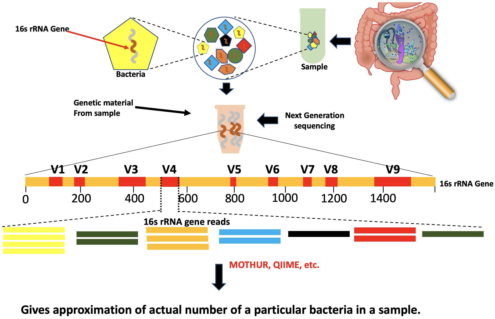

# Introduction
{:.no_toc}

<!-- This is a comment. -->

In this tutorial, you will learn and examine the potential utility of supervised and deep learning algorithms trained on microbial abundance data for a diverse range of biological classification tasks. 

First, we will introduce the microbial abundance data and how you can calculate the microbial abundance. A detailed tutorial on the microbiome you can find in the metagenomics section (link).

Finally, you will learn how different machine learning algorithm, feature selection, and  normalization methods can be utilized on microbial data to understand the disease, environment, etc. associated patterns. Further, you will learn to assess the performance of diverse machine learning methods across various microbiome-aware classification tasks and how properly tuned supervised learning methods can achieve very high classification accuracy. Furthermore, you will learn the importance of feature selection methods and normalization techniques and their implementation before machine learning modeling. 


> ### Agenda
>
> In this tutorial, we will cover:
>
> 1. TOC
> {:toc}
>
{: .agenda}

# Microbial abundance analysis with Mothur 

Microbial abundance is the relative representation of different bacterial species found per sample, While the relative abundance can be described by the ratio of the abundance of one species to one or multiple other species presents in a sample collected from the host or an ecosystem. 


> ###  Background: 16s rRNA Amplicon sequencing 
>WGS shotgun and amplicon-based sequencing are the two widely used techniques to analyze microbiome.   
>  <br><br>
>Microbial abundance is a quantitative approximation of all the  taxa present in a microbiome. 
>  <br><br>
> 
{: .comment}

For more information on the topic of 16s rRNA, please see training materials [here]()

## Details of the input data 

In this tutorial, we used 16sRNA data generated by [University of Michigan (SRA project ID: PRJNA338954)](https://www.ncbi.nlm.nih.gov//bioproject/PRJNA575562) in which they investigated Effects of Aquamin or Calcium supplementation on the human gut microbiota. Human colon biopsies and fecal samples were analyzed to determine the effects of Aquamin and Calcium on the microbiota using analysis of bacterial 16S rRNA gene sequences (V4 region). Among the 120, we used only the first 78 samples with the Aquamin or Calcium Carbonate treatment and created a binary problems on the basis of these two treatments. In order to assess the error rate of the analysis pipeline and experimental setup, the Schloss lab additionally sequenced a mock community with a known composition (genomic DNA from 21 bacterial strains). The sequences used for this mock sample are contained in the file `HMP_MOCK.v35.fasta`


> ###  Dataset naming scheme
> For this tutorial, you are given 78 pairs of files. For example, the following pair of files:<br />
>  `SRR10222293_1.fastq`<br />
>  `SRR10222293_2.fastq`
> _1 and _2 is used to indicate the forward and reverse reads
{: .comment}

<!-- note: mothur does not include day 4 in their SOP example data, therefore this description and results
in this document differ slightly from the description on their website -->

## Importing the data into Galaxy

Now that we know what our input data is, let's get it into our Galaxy history:

All data required for this tutorial has been made available from Zenodo [](https://doi.org/10.5281/zenodo.800651)

> ###  Hands-on: Obtaining our data
>
> 1. Make sure you have an empty analysis history. Give it a name.
>
>    
>
> 2. **Import Sample Data.**
>       - Import the sample FASTQ files to your history, either from a shared data library (if available), or from Zenodo
>         using the URLs listed in the box below (click  to expand):
>
>       > ###  List of Zenodo URLs
>       > ```
>       > https://zenodo.org/record/800651/files/F3D0_R1.fastq
>       > https://zenodo.org/record/800651/files/F3D0_R2.fastq
>       > https://zenodo.org/record/800651/files/F3D141_R1.fastq
>       > https://zenodo.org/record/800651/files/F3D141_R2.fastq
>       > https://zenodo.org/record/800651/files/F3D142_R1.fastq
>       > https://zenodo.org/record/800651/files/F3D142_R2.fastq
>       > https://zenodo.org/record/800651/files/F3D143_R1.fastq
>       > https://zenodo.org/record/800651/files/F3D143_R2.fastq
>       > https://zenodo.org/record/800651/files/F3D144_R1.fastq
>       > https://zenodo.org/record/800651/files/F3D144_R2.fastq
>       > https://zenodo.org/record/800651/files/F3D145_R1.fastq
>       > https://zenodo.org/record/800651/files/F3D145_R2.fastq
>       > https://zenodo.org/record/800651/files/F3D146_R1.fastq
>       > https://zenodo.org/record/800651/files/F3D146_R2.fastq
>       > https://zenodo.org/record/800651/files/F3D147_R1.fastq
>       > https://zenodo.org/record/800651/files/F3D147_R2.fastq
>       > https://zenodo.org/record/800651/files/F3D148_R1.fastq
>       > https://zenodo.org/record/800651/files/F3D148_R2.fastq
>       > https://zenodo.org/record/800651/files/F3D149_R1.fastq
>       > https://zenodo.org/record/800651/files/F3D149_R2.fastq
>       > https://zenodo.org/record/800651/files/F3D150_R1.fastq
>       > https://zenodo.org/record/800651/files/F3D150_R2.fastq
>       > https://zenodo.org/record/800651/files/F3D1_R1.fastq
>       > https://zenodo.org/record/800651/files/F3D1_R2.fastq
>       > https://zenodo.org/record/800651/files/F3D2_R1.fastq
>       > https://zenodo.org/record/800651/files/F3D2_R2.fastq
>       > https://zenodo.org/record/800651/files/F3D3_R1.fastq
>       > https://zenodo.org/record/800651/files/F3D3_R2.fastq
>       > https://zenodo.org/record/800651/files/F3D5_R1.fastq
>       > https://zenodo.org/record/800651/files/F3D5_R2.fastq
>       > https://zenodo.org/record/800651/files/F3D6_R1.fastq
>       > https://zenodo.org/record/800651/files/F3D6_R2.fastq
>       > https://zenodo.org/record/800651/files/F3D7_R1.fastq
>       > https://zenodo.org/record/800651/files/F3D7_R2.fastq
>       > https://zenodo.org/record/800651/files/F3D8_R1.fastq
>       > https://zenodo.org/record/800651/files/F3D8_R2.fastq
>       > https://zenodo.org/record/800651/files/F3D9_R1.fastq
>       > https://zenodo.org/record/800651/files/F3D9_R2.fastq
>       > https://zenodo.org/record/800651/files/Mock_R1.fastq
>       > https://zenodo.org/record/800651/files/Mock_R2.fastq
>       > ```
>       {: .solution }
>
>       
>
>       
>
> 3. **Import Reference Data**
>    - Import the following reference datasets
>      - `silva.v4.fasta`
>      - `HMP_MOCK.v35.fasta`
>      - `trainset9_032012.pds.fasta`
>      - `trainset9_032012.pds.tax`
>
>
>    > ###  List of Zenodo URLs
>    > ```
>    > https://zenodo.org/record/800651/files/HMP_MOCK.v35.fasta
>    > https://zenodo.org/record/800651/files/silva.v4.fasta
>    > https://zenodo.org/record/800651/files/trainset9_032012.pds.fasta
>    > https://zenodo.org/record/800651/files/trainset9_032012.pds.tax
>    > https://zenodo.org/record/800651/files/mouse.dpw.metadata
>    > ```
>    {: .solution }
{: .hands_on}

Galaxy equipped with a dataset collection tool to handle multiple datasets at once and facilitates us to create **dataset collections**.  **Paired-end** data can be converted into **List of Dataset Pairs**. This can be utilized to run the galaxy workflow. 


> ###  Hands-on: Organizing our data into a paired collection
>
> 1. Click on the **checkmark icon**  at top of your history.
>
> 2. Select all the FASTQ files (78 in total)
>    - **Tip:** type `fastq` in the search bar at the top of your history to filter only the FASTQ files; you can now use the `All` button at the top instead of having to individually select all 78 input files.
>    - Click on **for all selected..**
>    - Select **Build List of Dataset Pairs** from the dropdown menu
>
>    In the next dialog window you can create the list of pairs. By default Galaxy will look for pairs
>
> 3. You should now see a list of pairs suggested by Galaxy:
>
> 4. Click on **auto-pair** to create the suggested pairs.
>
> 5. **Name the pairs**
>    - The middle segment is the name for each pair.
>    - These names will be used as sample names in the downstream analysis, so always make sure they are informative!
>    - **Check** that the pairs are named `SRR10222293` and `Mock`.
>      - If needed, the names can be edited by clicking on them
> 6. **Name your collection** at the bottom right of the screen
> 7. Click the **Create List** button. A new dataset collection item will now appear in your history
{: .hands_on}


## Quality Control

Quality control is a vital step in NGS data analysis. A lot of research has gone into developing useful QC metrics for genomics experiments. 

For more information on the topic of quality control, please see training materials
[here]().


## Create contigs from paired-end reads


The **Make.contigs** tool creates the contigs, and uses the paired collection as input. This step combined the forward and reverse reads for each sample, and also combined the resulting contigs from all samples into a single file


> ###  Hands-on: Combine forward and reverse reads into contigs
>
> - **Make.contigs**  with the following parameters
>   -  *"Way to provide files"*: `Multiple pairs - Combo mode`
>   -  *"Fastq pairs"*: the collection you just created
>   - Leave all other parameters to the default settings
>
{: .hands_on}


## Data summary

> ###  Hands-on: Summarize data
>
> - **Summary.seqs**  with the following parameters
>   -  *"fasta"*: the `trim.contigs.fasta` file created by **Make.contigs** 
>   - *"Output logfile?"*: `yes`
>
{: .hands_on}

The `summary` output files give information per read. The `logfile` outputs also contain some summary


## Data Cleaning Step 1
 

We will improve the quality of our data by removing the low-quality sequences using three methods **Filter by length**, **Remove low-quality contig**  and by removing **deduplicate sequence**.

> ###  Hands-on: Perform data cleaning
>
>
> 2. Run **Workflow 1: Quality Control**  using the following parameters:
>    - *"Send results to a new history"*: `No`
>    -  *"1: Contigs"*: the `trim.contigs.fasta` output from **Make.contigs** 
>    -  *"2: Groups"*: the `group file` from **Make.contigs** 
>
>
{: .hands_on}
> ###  Hands-on: Filter reads based on quality and length
>
> - **Screen.seqs**  with the following parameters
>   -  *"fasta"*: the `trim.contigs.fasta` file created by **Make.contigs** 
>   -  *"group"*: the group file created in the **Make.contigs**  step
>   - *"maxlength"*: `275`
>   - *"maxambig"*: `0`
>
{: .hands_on}


## Optimize files for computation

 **Unique.seqs** tool will be used to determine the unique reads and the frequency of each read. 


> ###  Hands-on: Remove duplicate sequences
>
> - **Unique.seqs**  with the following parameters
>   -  *"fasta"*: the `good.fasta` output from **Screen.seqs** 
>   - *"output format"*: `Name File`
>
> > ###  Question
> >
> > How many sequences were unique? How many duplicates were removed?
> >
> > > ###  Solution
> > > 16,426 unique sequences and 112,446 duplicates.
> > >
> > > This can be determined from the number of lines in the fasta (or names) output, compared to the
> > > number of lines in the fasta file before this step.
> > {: .solution}
> {: .question}
{: .hands_on}

**Count.seqs** tool can be used to combine *group file* and the *names file* into a single *count table* which reduces the file size.


> ###  Hands-on: Generate count table
>
> - **Count.seqs**  with the following parameters
>   -  *"name"*: the `names` output from **Unique.seqs** 
>   - *"Use a Group file"*: `yes`
>   -  *"group"*: the `group file` we created using the **Screen.seqs** 
{: .hands_on}


## Sequence Alignment

For more information on the topic of alignment, please see our training materials  [here]()

We are now ready to align our sequences to the reference. This is an important
step to improve the clustering of your OTUs .


> ###  Hands-on: Align sequences
>
> 1. **Align.seqs**  with the following parameters
>   -  *"fasta"*: the `fasta` output from **Unique.seqs** 
>   -  *"reference"*: `silva.v4.fasta` reference file from your history
> <br><br>
>
>
{: .hands_on}


## Data Cleaning Step 2

To ensure that all our reads overlap our region of interest, we will:

1. Remove any reads not overlapping the region V4 region (position 1968 to 11550) using **Screen.seqs** .
2. Remove any overhang on either end of the V4 region to ensure our sequences overlap *only* the V4 region, using **Filter.seqs** .
3. Clean our alignment file by removing any columns that have a gap character (`-`, or `.` for terminal gaps) at that position in every sequence (also using **Filter.seqs** ).
4. Group near-identical sequences together with **Pre.cluster** . Sequences that only differ by one or two bases at this point are likely to represent sequencing errors rather than true biological variation, so we will cluster such sequences together.
 5. Remove Sequencing artefacts known as *chimeras* (discussed in next section). 



> ###  Hands-on: Remove poorly aligned sequences
>
> 1. **Screen.seqs**  with the following parameters
>   -  *"fasta"*: the aligned fasta file from **Align.seqs** 
>   - *"start"*: `1968`
>   - *"end"*: `11550`
>   - *"maxhomop"*: `8`
>   -  *"count"*: the `count table` file from **Count.seqs** 
>
>     **Note:** we supply the count table so that it can be updated for the sequences we're removing.
>
>     > ###  Question
>     >
>     >  How many sequences were removed in this step?
>     > > ###  Solution
>     > > 128 sequences were removed. This is the number of lines in the bad.accnos output.
>     > {: .solution }
>     {: .question}
>
>     Next, we will remove any overhang on either side of the V4 region, and
>
> 2. **Filter.seqs**  with the following parameters
>   -  *"fasta"*: `good.fasta` output from the latest **Screen.seqs** 
>   - *"vertical"*: `yes`
>   - *"trump"*: `.`
>   - *"Output logfile"*: `yes`
>
{: .hands_on}


> ###  Hands-on: Re-obtain unique sequences
>
> - **Unique.seqs**  with the following parameters
>   -  *"fasta"*: the `filtered fasta` output from **Filter.seqs** 
>   -  *"name file or count table"*: the `count table` from the last **Screen.seqs** 
>
> > ###  Question
> >
> >  How many duplicate sequences did our filter step produce?
> >
> > > ###  Solution
> > > 3: The number of unique sequences was reduced from 16298 to 16295
> > {: .solution }
> {: .question}
{: .hands_on}


### Pre-clustering

The next step in cleaning our data, is to merge near-identical sequences together. Sequences that only differ
by around 1 in every 100 bases are likely to represent sequencing errors, not true biological variation. Because
our contigs are ~250 bp long, we will set the threshold to 2 mismatches.

> ###  Hands-on: Perform preliminary clustering of sequences
>
> - **Pre.cluster**  with the following parameters
>   -  *"fasta"*: the `fasta` output from the last **Unique.seqs**  run
>   -  *"name file or count table"*: the `count table` from the last **Unique.seqs** 
>   - *"diffs"*: `2`
>
> > ###  Question
> >
> >  How many unique sequences are we left with after this clustering of highly similar sequences?
> > > ###  Solution
> > > 5720: This is the number of lines in the fasta output
> > {: .solution }
> {: .question}
{: .hands_on}




## Data Cleaning Step 3 

`VSEARCH` algorithm  that implimented inside mother as 
**Chimera.vsearch**  tool. We will use this tool to remove chimera sequences. 

> ###  Hands-on: Clean Aligned sequences and Chimera Removal
>
> 1. **Import the workflow** into Galaxy
>    - Copy the URL (e.g. via right-click) of [this workflow]({{ site.baseurl }}{{ page.dir }}workflows/workflow2_data_cleaning.ga) or download it to your computer.
>    - Import the workflow into Galaxy
>
>    
>
> 2. Run **Workflow 2: Data Cleaning and Chimera Removal**  using the following parameters:
>    - *"Send results to a new history"*: `No`
>    -  *"1: Aligned Sequences"*: the `align` output from **Align.seqs** 
>    -  *"2: Count Table"*: the `count table` from **Count.seqs** 
>
>    
>
> > ###  Question
> >
> > 1. How many chimeric sequences were detected?
> > 2. How many sequences remain after these cleaning steps?
> >
> > > ###  Solution
> > >
> > > 1. There were **3,439 representative sequences** flagged as chimeric. These represent a total of **10,564 total sequences**
> > >
> > >    This can be determined by looking at the number of sequences in the `vsearch.accnos` file (3439). To determine how many total sequences these represent, compare the Summary.seqs log output files before and after the chimera filtering step (128,655-118,091=10,564).
> > >
> > > 2. There are 2,281 remaining sequences after filtering, clustering of highly similar sequences, and chimera removal.
> > >
> > >    This can be determined by looking at the number of sequences in the fasta output of **Remove.seqs** 
> > {: .solution }
> {: .question}
>
{: .hands_on}

> ###  Hands-on: Remove chimeric sequences
>
> 1. **Chimera.vsearch**  with the following parameters
>   -  *"fasta"*: the `fasta` output from **Pre.cluster** 
>   -  *"Select Reference Template from"*: `Self`
>   -  *"count"*: the `count table` from the last **Pre.cluster** 
>   -  "dereplicate" to Yes
>
>     Running **Chimera.vsearch** with the count file will remove the chimeric sequences from the count table, but we
>     still need to remove those sequences from the fasta file as well. We do this using **Remove.seqs**:
>
> 2. **Remove.seqs**  with the following parameters
>   -  *"accnos"*: the `vsearch.accnos` file from **Chimera.vsearch** 
>   -  *"fasta"*: the `fasta` output from **Pre.cluster** 
>   -  *"count"*: the `count table` from **Chimera.vsearch** 
>
> > ###  Question
> >
> >  How many sequences were flagged as chimeric? what is the percentage? (Hint: summary.seqs)
> >
> > > ###  Solution
> > > Looking at the chimera.vsearch `accnos` output, we see that **3,439 representative sequences** were flagged as chimeric. If we run summary.seqs on the resulting fasta file and count table, we see that we went from 128,655
> > > sequences down to 118,091 total sequences in this step, for a reduction of **10,564 total sequences**, or 8.2%. This is a reasonable number of
> > > sequences to be flagged as chimeric.
> > {: .solution }
> {: .question}
{: .hands_on}


## Taxonomic Classification

After thoroughly cleaning the data next step is assigning taxonomies to the sequences. We will use  Bayesian classifier (via the **Classify.seqs**  tool) and a mothur-formatted [training
set provided by the Schloss lab](https://www.mothur.org/wiki/RDP_reference_files) based on the RDP (Ribosomal Database Project, ) reference taxonomy.


## Removal of non-bacterial sequences

Additionally, we will remove 18S rRNA gene fragments or 16S rRNA from Archaea, chloroplasts, and mitochondrial sequences.  These sequences usually never removed by the previous cleaning steps. 


> ###  Hands-on: Taxonomic Classification and removal of non-bacterial sequences
>
> 1. **Import the workflow** into Galaxy
>    - Copy the URL (e.g. via right-click) of [this workflow]({{ site.baseurl }}{{ page.dir }}workflows/workflow3_classification.ga) or download it to your computer.
>    - Import the workflow into Galaxy
>
>    
>
> 2. Run **Workflow 3: Classification**  using the following parameters:
>    - *"Send results to a new history"*: `No`
>    -  *"1: Cleaned sequences"*: the `fasta` output from **Remove.seqs** 
>    -  *"2: Count Table"*: the `count table` from **Remove.seqs** 
>    -  *"3: Training set Taxonomy"*: `trainset9_032012.pds.tax` file you imported from Zenodo
>    -  *"4: Training set FASTA"*: `trainset9_032012.pds.fasta` file from Zenodo
>
>    
>
> > ###  Questions
> >
> > How many non-bacterial sequences were removed? Determine both the number of *representative sequences* and *total sequences* removed.
> >
> > > ###  Solution
> > > There were **20 representative sequences** removed, representing **162 total sequences**.
> > > This can be determined by looking at the summary.seqs log outputs before the **Remove.lineage** step (after chimera removal), and after.
> > {: .solution }
> {: .question}
>
{: .hands_on}


> ###  Hands-on: Taxonomic Classification and Removal of undesired sequences
>
> 1. **Classify.seqs**  with the following parameters
>   -  *"fasta"*: the `fasta` output from **Remove.seqs** 
>   -  *"reference"*: `trainset9032012.pds.fasta` from your history
>   -  *"taxonomy"*: `trainset9032012.pds.tax` from your history
>   -  *"count"*: the `count table` file from **Remove.seqs** 
>
>     Have a look at the taxonomy output. You will see that every read now has a classification.
>
>     Now that everything is classified we want to remove our undesirables. We do this with the **Remove.lineage**
>     tool:
>
> 2. **Remove.lineage**  with the following parameters
>   -  *"taxonomy"*: the taxonomy output from **Classify.seqs** 
>   -  *"taxon - Manually select taxons for filtering"*: `Chloroplast-Mitochondria-unknown-Archaea-Eukaryota`
>   -  *"fasta"*: the `fasta` output from **Remove.seqs** 
>   -  *"count"*: the `count table` from **Remove.seqs** 
>
> > ###  Questions
> >
> > 1. How many unique (representative) sequences were removed in this step?
> > 2. How many sequences in total?
> >
> > > ###  Solution
> > > 1. 20 representative sequences were removed.
> > >    The fasta file output from Remove.seqs had 2281 sequences while the fasta output from Remove.lineages
> > >    contained 2261 sequences.
> > >
> > > 2. 162 total sequences were removed.
> > >    If you run summary.seqs with the count table, you will see that we now have 2261 unique sequences
> > >    representing a total of 117,929 total sequences (down from 118,091 before). This means 162 of our
> > >    sequences were in represented by these 20 representative sequences.
> > {: .solution }
> {: .question}
{: .hands_on}

The data is now as clean as we can get it. In the next section we will use the Mock sample to assess how accurate
our sequencing and bioinformatics pipeline is.


## OTU Clustering

In this tutorial we will continue with an OTU-based approach, for the phylotype and phylogenic approaches, please refer to the [mothur wiki page](https://www.mothur.org/wiki/MiSeq_SOP).


We will now repeat the OTU clustering we performed on our mock community for our real datasets. We use a slightly different workflow because these tools are faster for larger datasets. We will also normalize our data by subsampling to the level of the sample with the lowest number of sequences in it.


### Remove Mock Sample

Now that we have cleaned up our data set as best we can, and assured ourselves of the quality of our sequencing
pipeline by considering a mock sample, we are almost ready to cluster and classify our real data. But
before we start, we should first remove the Mock dataset from our data, as we no longer need it. We do this using
the **Remove.groups** tool:

> ###  Hands-on: Remove Mock community from our dataset
>
> - **Remove.groups**  with the following parameters
>   -  *"Select input type"*: `fasta , name, taxonomy, or list with a group file or count table`
>   -  *"group or count table"*: the `pick.count_table` output from **Remove.lineage** 
>   -  *"groups"*: `Mock`
>   -  *"fasta"*: the `pick.fasta` output from **Remove.lineage** 
>   -  *"taxonomy"*: the `pick.taxonomy` output from **Remove.lineage** 
>
{: .hands_on}

### Cluster sequences into OTUs

There are several ways we can perform clustering. For the Mock community, we used the traditional approach of
using the **Dist.seqs** and **Cluster** tools. Alternatively, we can also use the **Cluster.split** tool. With
this approach, the sequences are split into bins, and then clustered with each bin.  Taxonomic information is used to guide this process.
The Schloss lab have [published results](https://www.mothur.org/wiki/MiSeq_SOP#OTUs) showing that if you split at the level of Order or Family, and cluster to a 0.03
cutoff, you'll get just as good of clustering as you would with the "traditional" approach. In addition, this approach
is less computationally expensive and can be parallelized, which is especially advantageous when you have large
datasets.

We'll now use the **Cluster** tool, with `taxlevel` set to `4`, requesting that clustering be done at the *Order* level.

> ###  Hands-on: Cluster our data into OTUs
>
> 
>
> 1. **Import the workflow** into Galaxy
>    - Copy the URL (e.g. via right-click) of [this workflow]({{ site.baseurl }}{{ page.dir }}workflows/workflow5_otu_clustering.ga) or download it to your computer.
>    - Import the workflow into Galaxy
>
>    
>
> 2. Run **Workflow 5: OTU Clustering**  using the following parameters:
>    - *"Send results to a new history"*: `No`
>    -  *"1: Sequences"*: the `fasta` output from **Remove.lineage** 
>    -  *"2: Count table"*: the `count table` output from **Remove.lineage** 
>    -  *"3: Taxonomy"*: the `taxonomy` output from **Remove.lineage** 
>
>    
>
> 
>
> 1. **Cluster.split**  with the following parameters
>   - *"Split by"*: `Classification using fasta`
>   -  *"fasta"*: the `fasta` output from **Remove.groups** 
>   -  *"taxonomy"*: the `taxonomy` output from **Remove.groups** 
>   -  *"name file or count table"*: the `count table` output from **Remove.groups** 
>   - *"taxlevel"*: `4`
>   - *"cutoff"*: `0.03`
>
>    Next we want to know how many sequences are in each OTU from each group and we can do this using the
>    **Make.shared** tool. Here we tell mothur that we're really only interested in the 0.03 cutoff level:
>
> 2. **Make.shared**  with the following parameters
>   -  *"list"*: the `list` output from **Cluster.split** 
>   -  *"count"*: the `count table` from **Remove.groups** 
>   - *"label"*: `0.03`
>
>    We probably also want to know the taxonomy for each of our OTUs. We can get the consensus taxonomy for each
>    OTU using the **Classify.otu** tool:
>
> 3. **Classify.otu**  with the following parameters
>   -  *"list"*: the `list` output from **Cluster.split** 
>   -  *"count"*: the `count table` from **Remove.groups** 
>   -  *"taxonomy"*: the `taxonomy` output from **Remove.groups** 
>   - *"label"*: `0.03`
>
> 
{: .hands_on}

> ###  Hands-on: Subsampling
>
> First we want to see how many sequences we have in each sample. We'll do this with the
> **Count.groups** tool:
>
> 1. **Count.groups**  with the following parameters
>   -  *"shared"*: the `shared` file from **Make.shared** 
>
>    > ###  Question
>    > How many sequences did the smallest sample consist of?
>    > > ###  Solution
>    > > The smallest sample is `F3D143`, and consists of 2389 sequences. This is a reasonable number, so we will now subsample all the other samples down to this level.
>    > {: .solution}
>    {: .question}
>
> 2. **Sub.sample**  with the following parameters
>   - *"Select type of data to subsample"*: `OTU Shared`
>   -  *"shared"*: the `shared` file from **Make.shared** 
>   - *"size"*: `2389`
>
>    > ###  Question
>    >
>    >  What would you expect the result of `count.groups` on this new shared output collection to be? Check if you are correct.
>    > > ###  Solution
>    > > all groups (samples) should now have 2389 sequences. Run count.groups again on the shared output collection by the sub.sample
>    > > tool to confirm that this is indeed what happened.
>    > {: .solution }
>    {: .question}
>
> **Note:** since subsampling is a stochastic process, your results from any tools using this subsampled data
> will deviate from the ones presented here.
{: .hands_on}


## Generating biom file

Finally, we will generate the biom file for further processing. 

> ###  Hands-on: Task description
>
> 1. **Make.biom**  with the following parameters:
>    -  *"shared - OTU Shared file"*: `shared_out` (output of **Sub.sample** )
>    -  *"contaxonomy - consensus taxonomy"*: `taxonomies` (output of **Classify.otu** )
>    - *"use picrust program"*: `no`
>
>    ***TODO***: *Check parameter descriptions*
>
>    ***TODO***: *Consider adding a comment or tip box*
>
{: .hands_on}

***TODO***: *Consider adding a question to test the learners understanding of the previous exercise*

## Convert biom file into tabular formate

 We will use tool **Convert** to convert **biom** file into **tabular** formate

> ###  Hands-on: Task description
>
> 1. **Convert**  with the following parameters:
>    - *"Choose the source BIOM format"*: `BIOM File`
>        -  *"Input BIOM table"*: `biomfiles` (output of **Make.biom** )
>    - *"Choose the output type"*: `TSV-formatted (classic) table`
>
>    ***TODO***: *Check parameter descriptions*
>
>    ***TODO***: *Consider adding a comment or tip box*
>
>    > ###  Comment
>    >
>    > A comment about the tool or something else. This box can also be in the main text
>    {: .comment}
>
{: .hands_on}


# Utilizing microbial abundance data in machine learning 

Microarray and RNA-Seq data have been previously interrogated with machine learning methods. Microbiome data can also be utilized to explore various potential clinical connections between host, environment and microbial cohorts using supervised machine learning methodology.

> ###  Background: 16s rRNA Amplicon sequencing 
>WGS shotgun and amplicon-based sequencing are the two widely used techniques to analyze microbiome.   
>  <br><br>
>
>Microbial abundance is a quantitative approximation of all the  taxa present in a microbiome. 
> 
{: .comment}


## Data transformation 

We use **Transform Dataframe** tool to transform data where row represents the sample while column represents the OTU ids 


> ###  Hands-on: Task description
>
> 1. **Transform Dataframe**  with the following parameters:
>    -  *""*: `output_fp` (output of **Convert** )
>
>    ***TODO***: *Check parameter descriptions*
>
>    ***TODO***: *Consider adding a comment or tip box*
>
>    > ###  Comment
>    >
>    > A comment about the tool or something else. This box can also be in the main text
>    {: .comment}
>
{: .hands_on}

***TODO***: *Consider adding a question to test the learners understanding of the previous exercise*


## Merging aditinal metadata with abudance count 

We will use **Merge Metadata** tool to merge class_label and other metadata 

> ###  Hands-on: Task description
>
> 1. **Merge MetaData**  with the following parameters:
>    -  *""*: `output1` (output of **Transform Dataframe** )
>
>    ***TODO***: *Check parameter descriptions*
>
>    ***TODO***: *Consider adding a comment or tip box*
>
>    > ###  Comment
>    >
>    > A comment about the tool or something else. This box can also be in the main text
>    {: .comment}
>
{: .hands_on}

***TODO***: *Consider adding a question to test the learners understanding of the previous exercise*


# Machine learning modeling and prediction 

***TODO***: *Consider adding a question to test the learners understanding of the previous exercise*


## Neutralizing useless features using unsupervised methods. 


All the useless columns with zero relative abundance for  more than 98% of the samples were eliminated. In order to remove the correlated features a straightforward unsupervised feature elimination method was applied and pairwise correlation was calculated. Correlated features show how features are related to each other or with the target variable. Correlated features decrease generalization performance and model interpretability on the test set, hence for each pair of correlated features, the algorithm identifies one of the features for removal 

> ###  Hands-on: Task description
>
> 1. **Feature Selection**  with the following parameters:
>    - *"FeatSelect"*: `Corr`
>        - *""*: `0.7`
>    -  *""*: `output1` (output of **Merge Meta Data** )
>
>    ***TODO***: *Check parameter descriptions*
>
>    ***TODO***: *Consider adding a comment or tip box*
>
>    > ###  Comment
>    >
>    > A comment about the tool or something else. This box can also be in the main text
>    {: .comment}
>
{: .hands_on}

***TODO***: *Consider adding a question to test the learners understanding of the previous exercise*


## Selecting feature using supervised methods

Feature selection methods commonly applied to explore and eliminate redundant features,  and select an appropriate set of features that maximize the classifier performance and minimize the computational cost (Li et al. 2018) because, less important features usually compromise speed and overall performance during model building (Friedman  et al. 2001).  Three different methods  (1) univariate feature selection, in which statistical test determines the features relation with the output variable,(2) feature importance, where you can extract the feature importance property of your model and (3) gradient boosting feature selection, in which algorithms find zero importance according to a gradient boosting machine (GBM) learning model, were examined in this work.


> ###  Hands-on: Task description
>
> 1. **Feature Selection**  with the following parameters:
>    - *"FeatSelect"*: `SelBest`
>    -  *""*: `output1` (output of **Feature Selection** )
>
>    ***TODO***: *Check parameter descriptions*
>
>    ***TODO***: *Consider adding a comment or tip box*
>
>    > ###  Comment
>    >
>    > A comment about the tool or something else. This box can also be in the main text
>    {: .comment}
>
{: .hands_on}

***TODO***: *Consider adding a question to test the learners understanding of the previous exercise*


## Assessment of different machine learning algorithms on example data set 

Binary Classification
We have included eight supervised and one deep learning algorithms for classification: 
1. Logistic Regression (LR), a method based on the direct probability model (Stoltzfus et  al. 2011). 
2. Gaussian Naive-Basie (GNB) algorithms, comparatively easy to apply but often proves to be a very powerful supervised learning method is based on the Bayesian theorem (Friedman et al. 1997). 
3. K-nearest neighbor (KNB) algorithm, a non-parametric algorithm used in statistical learning to solve classification and regression problems, where the input consists of k proximate training data set in terms of feature space (Cunningham at el. 2007). 
4. Decision-tree classifier (DTC) adopts a decision tree as a model for predicting map features about a sample including target or class value (Jenhani et al. 2008). 
5. Support vector machine (SVM) is a statistical learning method and it relies on structural risk minimization, and it also takes a set of feature vectors to predict the class labels (Cortes et al. 1995). 
6. Random Forest (RF) is a meta estimator that calculates a number of decision trees and performs analysis on the subsample of data input data (Liaw et al. 2002). 
7. Gradient boosting (GB) algorithm creates an additive model in a forward stage-wise fashion and works on the basis of arbitrary differentiable loss function (Natekin and Knoll et  al. 2013). 
8. Stochastic gradient descent (SGD) is a very powerful algorithm and applies discriminative learning of linear classifiers under convex loss function (Zhang et al. 2004) 
9. Artificial neural networks (ANN) mimic human neural networks and build on several units of perceptrons. A simple perceptron has one input layer and one neuron while a multilayer perceptron is built on several layers and widely used (Gurney et al. 1996). 

All the above methods classify data in binary or multiclass fashion on the basis of their class labels (positive or negative, i.e.  or 0, 1,  2, etc.  respectively). In order to enhance the robustness and  accuracy of a classifier, 10 fold cross-validation was implemented  (Kohavi et al. 1995). During 10 fold cross-validation, the training data set randomly divided into 10 sets, and the 


> ###  Hands-on: Task description
>
> 1. **Binary Prediction**  with the following parameters:
>    -  *""*: `output1` (output of **Feature Selection** )
>    - *"MLAlgo"*: `DTC`
>        - *"Specify advanced parameters"*: `No, use program defaults.`
>    - *"Choose the Test method"*: `Internal`
>
>
> 1. **Binary Prediction**  with the following parameters:
>    -  *""*: `output1` (output of **Feature Selection** )
>    - *"MLAlgo"*: `RFC`
>        - *"Specify advanced parameters"*: `No, use program defaults.`
>    - *"Choose the Test method"*: `Internal`
>
>
> 1. **Binary Prediction**  with the following parameters:
>    -  *""*: `output1` (output of **Feature Selection** )
>    - *"MLAlgo"*: `GBC`
>        - *"Specify advanced parameters"*: `No, use program defaults.`
>    - *"Choose the Test method"*: `Internal`
> 1. **Binary Prediction**  with the following parameters:
>    -  *""*: `output1` (output of **Feature Selection** )
>    - *"MLAlgo"*: `SGDC`
>        - *"Specify advanced parameters"*: `No, use program defaults.`
>    - *"Choose the Test method"*: `Internal`
>
>
> 1. **Binary Prediction**  with the following parameters:
>    -  *""*: `output1` (output of **Feature Selection** )
>    - *"MLAlgo"*: `SGDC`
>        - *"Specify advanced parameters"*: `No, use program defaults.`
>    - *"Choose the Test method"*: `Internal`
>
>
>    > ###  Comment
>    >
>    > A comment about the tool or something else. This box can also be in the main text
>    {: .comment}
>
{: .hands_on}

***TODO***: *Consider adding a question to test the learners understanding of the previous exercise*


> ###  Hands-on: Task description
>
> 1. **Merge Dataframe**  with the following parameters:
>    -  *""*: `output1` (output of **Binary Prediction** )
>
>    ***TODO***: *Check parameter descriptions*
>
>    ***TODO***: *Consider adding a comment or tip box*
>
>    > ###  Comment
>    >
>    > A comment about the tool or something else. This box can also be in the main text
>    {: .comment}
>
{: .hands_on}

***TODO***: *Consider adding a question to test the learners understanding of the previous exercise*

> ###  Questions
>
> 1. Question1?
> 2. Question2?
>
> > ###  Solution
> >
> > 1. Answer for question1
> > 2. Answer for question2
> >
> {: .solution}
>
{: .question}


